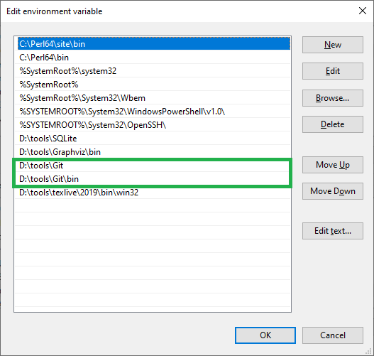
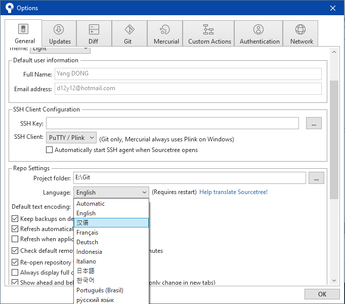
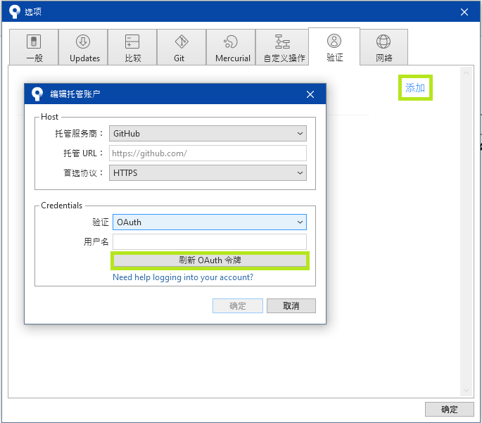
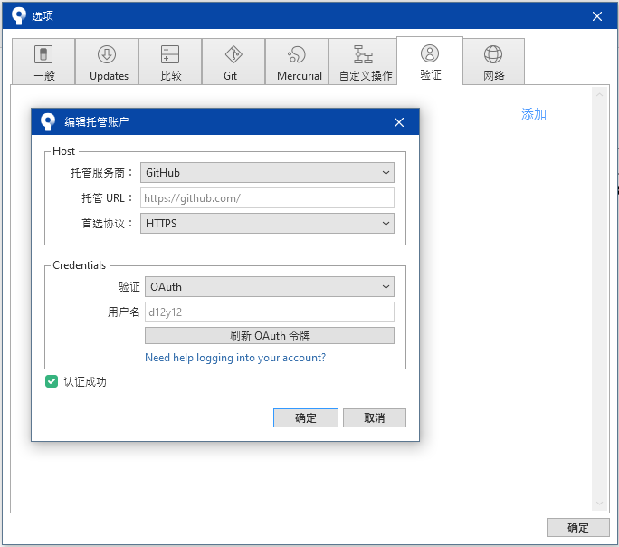
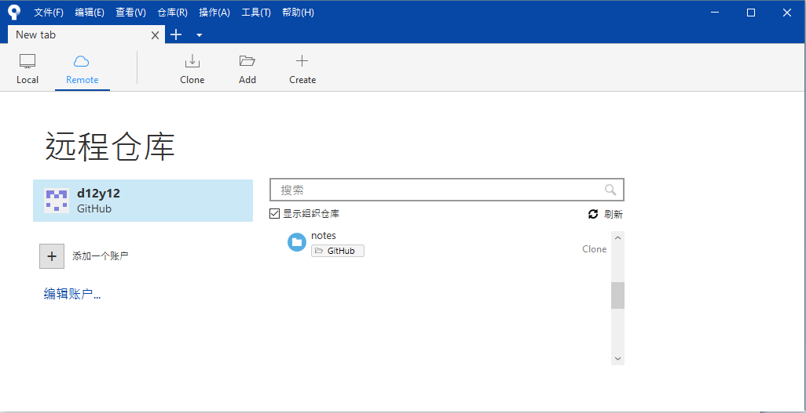
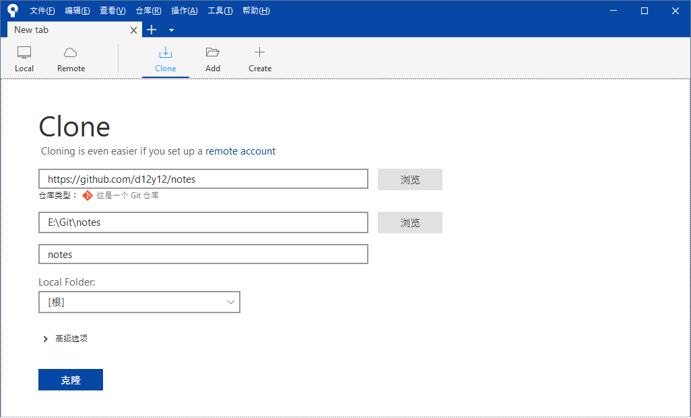
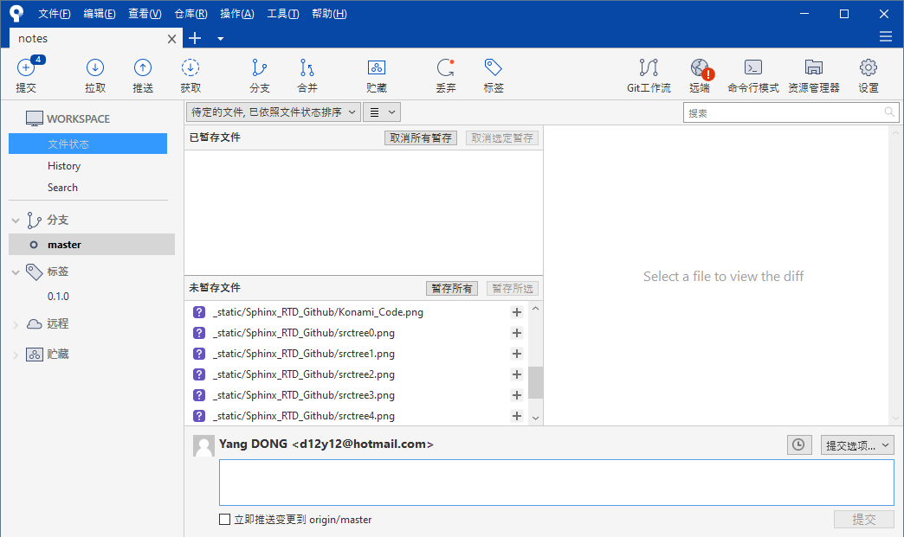
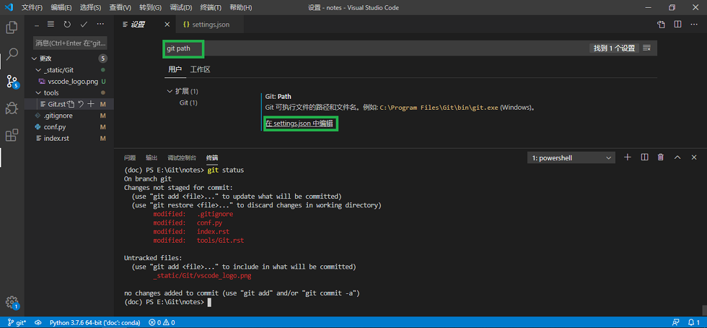
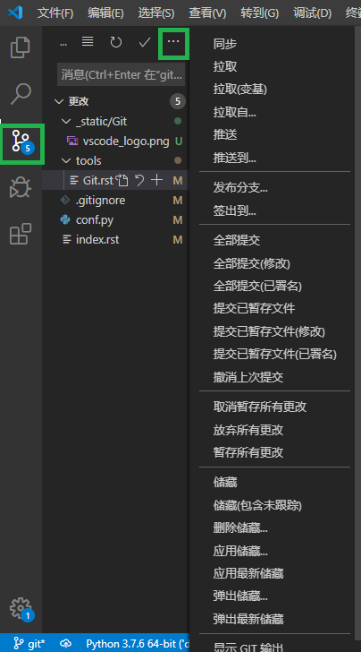

.. Git:

Git
====

Git 命令
--------

速查表
~~~~~~

+--------------------------------------------+-------------------------------+
|                                            |                               |
+============================================+===============================+
| **帮助**                                   |                               |
+--------------------------------------------+-------------------------------+
| ``git COMMAND --help``                     | 查看帮助信息                  |
+--------------------------------------------+-------------------------------+
| **配置工具**                               |                               |
+--------------------------------------------+-------------------------------+
| ``git config --global user.name "<name>"`` | 对你的提交设置关联的用户名    |
+--------------------------------------------+-------------------------------+
| ``git config --global user.email <email>`` | 对你的提交设置关联的邮箱地址  |
+--------------------------------------------+-------------------------------+
| ``git config --global color.ui auto``      | 命令行彩色输出                |
+--------------------------------------------+-------------------------------+
| ``git config --list``                      | 查看配置列表                  |
+--------------------------------------------+-------------------------------+
| **创建仓库**                               |                               |
+--------------------------------------------+-------------------------------+
| ``git init <directory>``                   | 将目标目录转换为 Git 仓库     |
+--------------------------------------------+-------------------------------+
| ``git init``                               | 将当前目录转换为 Git 仓库     |
+--------------------------------------------+-------------------------------+
| ``git clone <URL>``                        | **克隆** 现有的仓库, 包括     |
|                                            | 所有的文件、分支和提交        |
+--------------------------------------------+-------------------------------+
| **本地修改**                               |                               |
+--------------------------------------------+-------------------------------+
| ``git add <directory>``                    | 将目录内的所有更改 **添加**   |
|                                            | 到暂存区                      |
+--------------------------------------------+-------------------------------+
| ``git add <file>``                         | 将文件内的所有更改 **添加**   |
|                                            | 到暂存区                      |
+--------------------------------------------+-------------------------------+
| ``git add -p``                             | 将文件内的所有更改分次        |
|                                            | **添加** 到暂存区             |
+--------------------------------------------+-------------------------------+
| ``git commit -m "<message>"``              | **提交** 暂存的内容到本地仓库 |
+--------------------------------------------+-------------------------------+
| ``git commit -a -m "<message>"``           | 跳过暂存直接 **提交** 更改    |
|                                            | 到本地仓库                    |
+--------------------------------------------+-------------------------------+
| ``git rm <file>``                          | 从项目 **删除** 文件，并      |
|                                            | 记录到暂存区                  |
+--------------------------------------------+-------------------------------+
| ``git rm --cached <file>``                 | 停止追踪指定文件，但该文件会  |
|                                            | 保留在工作区                  |
+--------------------------------------------+-------------------------------+
| ``git mv <old-path> <new-path>``           | 在项目 **移动** 文件，并      |
|                                            | 记录到暂存区                  |
+--------------------------------------------+-------------------------------+
| ``git diff``                               | 显示未暂存的更改              |
+--------------------------------------------+-------------------------------+
| ``git diff --staged``                      | 显示已暂存未提交的更改        |
+--------------------------------------------+-------------------------------+
| ``git status``                             | 显示工作区状态                |
+--------------------------------------------+-------------------------------+
| ``git checkout -- <file>``                 | **丢弃** 工作区的更改         |
+--------------------------------------------+-------------------------------+
| ``git reset <file>``                       | **撤销** 文件的暂存区更改，   |
|                                            | 工作区不变                    |
+--------------------------------------------+-------------------------------+
| ``git reset --hard HEAD^``                 | **撤销** 暂存区的更改，       |
|                                            | 工作区 **回退** 到上一版本    |
|                                            |                               |
|                                            | * ^表示上一版本               |
|                                            | * ^^表示上两个版本            |
|                                            | * ~N表示上N个版本             |
+--------------------------------------------+-------------------------------+
| ``git reset``                              | 暂存区 **回退** 到上次提交，  |
|                                            | 工作区不变                    |
+--------------------------------------------+-------------------------------+
| ``git reset --hard``                       | 暂存区清空，                  |
|                                            | 工作区 **回退** 到上次提交    |
+--------------------------------------------+-------------------------------+
| ``git revert <commit>``                    | 创建一个新的提交**撤销**      |
|                                            | <commit>中的更改，            |
|                                            |                               |
|                                            | 然后应用在当前分支            |
+--------------------------------------------+-------------------------------+
| ``git commit --amend -m "<message>"``      | 用暂存区更改和最后一次提交    |
|                                            | 更改的组合                    |
|                                            |                               |
|                                            | **替换** 最后一次提交         |
|                                            |                               |
|                                            | 如果暂存区为空, 则修改        |
|                                            | 最后一次提交的信息            |
+--------------------------------------------+-------------------------------+
| ``git reset <commit>``                     | HEAD 指向 <commit>，          |
|                                            | 工作区不变                    |
+--------------------------------------------+-------------------------------+
| ``git reset --hard <commit>``              | 清空暂存区，用指定<commit>    |
|                                            | 覆盖工作区                    |
+--------------------------------------------+-------------------------------+
| ``git log``                                | 本地仓库提交日志              |
|                                            |                               |
|                                            | * --oneline 每个提交一行      |
|                                            | * --graphe 基于文本的图形化   |
+--------------------------------------------+-------------------------------+
| ``git reflog``                             | 本地仓库 HEAD 更改日志        |
|                                            |                               |
|                                            | * --relative-dat 显示时间     |
|                                            | * --all 显示全部              |
+--------------------------------------------+-------------------------------+
| **分支**                                   |                               |
+--------------------------------------------+-------------------------------+
| ``git branch``                             | 列出本地所有分支，当前分支    |
|                                            | 前面会标一个 ``*`` 号         |
|                                            |                               |
|                                            | * -r 列出远程所有分支         |
|                                            | * -a 列出所有分支             |
+--------------------------------------------+-------------------------------+
| ``git branch <branch-name>``               | **创建** 一个新分支           |
+--------------------------------------------+-------------------------------+
| ``git checkout <branch-name>``             | **切换** 到指定分支           |
|                                            | 并更新工作区                  |
| ``git switch <branch-name>``               |                               |
+--------------------------------------------+-------------------------------+
| ``git checkout -b <branch-name>``          | **创建** 并 **切换** 到       |
|                                            | 指定分支                      |
| ``git switch -c <branch-name>``            |                               |
+--------------------------------------------+-------------------------------+
| ``git merge <branch-name>``                | **合并** 指定分支到           |
|                                            | 当前分支                      |
|                                            |                               |
|                                            | * --no-ff 禁用 Fast forward   |
|                                            |   模式                        |
|                                            | * -m 添加描述                 |
+--------------------------------------------+-------------------------------+
| ``git cherry-pick <commit>``               | 选择一个commit，              |
|                                            | 合并进当前分支                |
+--------------------------------------------+-------------------------------+
| ``git rebase <branch-name>``               | 将提交到当前分支上的所有修改  |
|                                            |                               |
|                                            | 都 **合并** 至另一分支上      |
|                                            |                               |
|                                            | rebase 通过合并操作来         |
|                                            | 整合分叉了的历史              |
|                                            |                               |
|                                            | 不要对在你的仓库外有副本的    |
|                                            | 分支执行变基。                |
+--------------------------------------------+-------------------------------+
| ``git branch -d <branch-name>``            | **删除** 指定分支             |
+--------------------------------------------+-------------------------------+
| **标签**                                   |                               |
+--------------------------------------------+-------------------------------+
| ``git tag``                                | 列出所有标签                  |
+--------------------------------------------+-------------------------------+
| ``git tag <tag-name> <commit>``            | **创建** 标签，如不指定       |
|                                            | <commit>, 默认为 HEAD         |
+--------------------------------------------+-------------------------------+
| ``git tag -a <tag-name> -m "message"``     | **创建** 标签，使用 -m        |
|                                            | 添加说明                      |
+--------------------------------------------+-------------------------------+
| **远程仓库**                               |                               |
+--------------------------------------------+-------------------------------+
| ``git remote add <alias> <url>``           | **关联** 一个远程库, alias    |
|                                            | 为别名，如 "orginal"          |
+--------------------------------------------+-------------------------------+
| ``git fetch <alias> <branch>``             | 从远程库 **拉取** 指定分支，  |
|                                            |                               |
|                                            | 如不带分支，则拉取所有分支    |
+--------------------------------------------+-------------------------------+
| ``git merger <alias>/<branch>``            | 将远程库指定分支，            |
|                                            | **合并** 到当前分支           |
+--------------------------------------------+-------------------------------+
| ``git pull``                               | 从远程分支 **拉取** 并        |
|                                            | **合并**                      |
+--------------------------------------------+-------------------------------+
| ``git push <alias> <branch>``              | 从指定分支最新修改 **推送**   |
|                                            | 到远程库                      |
+--------------------------------------------+-------------------------------+
| **储藏与清理**                             |                               |
+--------------------------------------------+-------------------------------+
| ``git stash``                              | **储藏** 工作区和暂存区的更改 |
+--------------------------------------------+-------------------------------+
| ``git stash list``                         | 列出现有的储藏                |
+--------------------------------------------+-------------------------------+
| ``git stash apply <stash-name>``           | **重新应用** 指定储藏         |
+--------------------------------------------+-------------------------------+
| ``git stash drop <stash-name>``            | **移除** 应用指定储藏         |
+--------------------------------------------+-------------------------------+
| ``git clean -n``                           | 展示工作区中将被清理的文件，  |
|                                            |                               |
|                                            | 如未被追踪的文件或空文件夹    |
+--------------------------------------------+-------------------------------+
| ``git clean -f``                           | 执行 **清理**                 |
+--------------------------------------------+-------------------------------+

场景
~~~~

工作流
-------

工作流的选择取决于团队规模，项目大小，个人习惯等。 不管哪种方式，要习惯经常创建，合并，
删除分支。 以我写这个文档为例，也使用了非常简单的工作流，比如使用一个主分支 ``master`` ,
写新的文档时创建一个基于 ``master`` 的分支，文档写完，把分支合并进 ``master``, 然后删除
分支。 下面列举几种广泛使用并在实践中证明过的工作流，可以根据实际情况进行选择。

.. note::

   本章中部分文字和图片出自: 
   
   * `Git Flow Workflow <https://leanpub.com/git-flow/read>`_
   * `廖雪峰的Git教程 <https://www.liaoxuefeng.com/wiki/896043488029600>`_
   * `阮一峰的Git分支管理策略 <http://www.ruanyifeng.com/blog/2012/07/git.html>`_

Git Flow
~~~~~~~~~

Git flow 来自 Vincent Driessen 在2010年发表的分支管理策略 
`A successful Git branching model`_ 。 

.. image:: ../_static/Git/git_flow_0.png
   :target: ../_static/Git/git_flow_0.png

有意思的是今年他又在他的帖子上增加了一个类似于 "10年回顾" 的东西：

   “If your team is doing continuous delivery of software, I would suggest to 
   adopt a much simpler workflow (like GitHub flow) instead of trying to 
   shoehorn git-flow into your team.

   If, however, you are building software that is explicitly versioned, or 
   if you need to support multiple versions of your software in the wild, 
   then git-flow may still be as good of a fit to your team as it has been to 
   people in the last 10 years. In that case, please read on.

   To conclude, always remember that panaceas don't exist. 
   Consider your own context. Don't be hating. Decide for yourself.”

我觉得其中三点对我们选择工作流非常有帮助:

#. 没有万能药，适合的才是最好的
#. 如果你的团队使用持续部署的方式提供软件或者服务，简单的工作流 (如 GitHub flow) 可能更合适
#. 如果你的团队提供基于版本的软件，对不同的版本还要提供持续的支持，那么 Git flow 应该还是合适的 

.. _`A successful Git branching model`: https://nvie.com/posts/a-successful-git-branching-model/

我们从这张示意图开始:

.. image:: ../_static/Git/git_flow_1.png

Git flow 使用一个中心仓库作为所有开发者的沟通中心。 开发者在本地开发然后推送分支到中心仓库。

* 主分支
  中心仓库保持两个永久存在的主分支
  
  .. image:: ../_static/Git/git_flow_2.png

  * ``master`` : 用于存放对外发布的版本，标签永远打在 master 分支上。该分支是一个稳定分支，任何时刻都是可以发布的。
  * ``develop``：作为一个集成分支，用于日常开发，存放最新的开发版。 可以每天拉取此分支做 nightly build。

* 支持分支

  支持分支的作用是辅助团队成员并行开发，追踪功能，准备版本发布，快速修复已有版本问题。 支持分支是临时性的，使用完后
  需要删除。 
  支持分支按作用分为三种：
    
     * 功能( feature )分支
     * 预发布( release )分支
     * 修复( hotfix )分支

  * 功能分支
    
    .. image:: ../_static/Git/git_flow_3.png

    如上图所示，每一个功能分支都是为实现新的功能创建，不要把多个功能混合在同一功能分支：

       * 开始: 从 ``develop`` 分支创建
       * 结束: 合并回 ``develop`` 分支
       * 命名: 任何名称除了 master, develop, release-*, hotfix-*
    
    例如:

    +------------------------------------------+---------------------------------+
    | 开始                                     | 结束                            |
    +==========================================+=================================+
    | ``git checkout -b feature-x develop``    | ``git checkout develop``        |
    |                                          |                                 |
    |                                          | ``git merge --no-ff feature-x`` |
    |                                          |                                 |
    |                                          | ``git branch -d feature-x``     |
    +------------------------------------------+---------------------------------+    

  * 预发布分支
    当开发版本满足发版本要求的时候，我们需要一个创建一个预发布分支，一部分成员可以继续开发新的
    功能，另一部分，可以在预发布分支上进行准备，如测试，生成文档，bug修改等待。

    .. image:: ../_static/Git/git_flow_4.png
     
    预发布分支上不能开发任何新功能，只能进行 bug 修改：

       * 开始: 从 ``develop`` 分支创建
       * 结束: 合并回 ``develop`` 分支和 ``master`` 分支
       * 命名: release-*
     
    例如:

    +------------------------------------------+----------------------------------+
    | 开始                                     | 结束                             |
    +==========================================+==================================+
    | ``git checkout -b release-1.2 develop``  | ``git checkout master``          |
    |                                          |                                  |
    |                                          | ``git merge --no-ff release-1.2``|
    |                                          |                                  |
    |                                          | ``git tag -a 1.2``               |
    |                                          |                                  |
    |                                          | ``git checkout develop``         |
    |                                          |                                  |
    |                                          | ``git merge --no-ff release-1.2``|
    |                                          |                                  |
    |                                          | ``git branch -d release-1.2``    |
    +------------------------------------------+----------------------------------+

  * 修复分支

    .. image:: ../_static/Git/git_flow_5.png
    
    当发布的版本出现问题时，需要创建一个修复分支来修复 bug：

       * 开始: 从 ``master`` 分支创建
       * 结束: 合并回 ``master`` 分支和 ``develop`` 分支
       * 命名: hotfix-*       

    例如:

    +------------------------------------------+----------------------------------+
    | 开始                                     | 结束                             |
    +==========================================+==================================+
    | ``git checkout -b hotfix-1.2 master``    | ``git checkout master``          |
    |                                          |                                  |
    |                                          | ``git merge --no-ff hotfix-1.2`` |
    |                                          |                                  |
    |                                          | ``git tag -a 1.2.1``             |
    |                                          |                                  |
    |                                          | ``git checkout develop``         |
    |                                          |                                  |
    |                                          | ``git merge --no-ff hotfix-1.2`` |
    |                                          |                                  |
    |                                          | ``git branch -d hotfix-1.2``     |
    +------------------------------------------+----------------------------------+

.. important::

   这里 merge 使用了 ``--no-ff`` 是为了保留分支信息。

   ``fast-farward merge`` VS ``--no-ff``

   .. image:: ../_static/Git/git_flow_6.png

下面这个图中总结了上面的命令：

.. image:: ../_static/Git/git_flow_7.png
   :target: ../_static/Git/git_flow_7.png

Windows 版的 Git 集成了 ``git flow`` 命令，可以使上面的命令简单些

.. image:: ../_static/Git/git_flow_8.png

这里的 ``start`` 和 ``finish`` 命令对应 git 命令中的开始和结束流程。 

.. seealso::

   更多 ``git flow`` 的例子参见 
   `Using git-flow to automate your git branching workflow <https://jeffkreeftmeijer.com/git-flow/>`_

GitHub Flow
~~~~~~~~~~~~~

`GitHub Flow`_ 是一个轻量级的，基于分支的工作流，用来支持持续部署的团队和项目。

.. image:: ../_static/Git/github_flow.png

#. 从 ``master`` 创建一个新分支
#. 添加提交。 每个提交都要带有信息描述为什么进行更改。 而且，每个提交都被视作
   一个独立的更改单元，这样如果发现 bug 或者决定换个方向的时候比较容易回退。
#. 发起一个 ``Pull Request (PR)`` 。 ``PR`` 会开启一个关于你的提交的讨论。
   
   ``PR`` 是一个对话机制，你可以在开发的任何时候发起, 比如即使你还没写代码或者
   刚写了一小部分，但想和其他人分享你的截屏或者想法，比如你卡住了需要其他人帮助，
   比如你准备好让其他人做代码检视。 你还可以在 PR 中使用 GitHub 的 @mention 系统，
   说白了就是 @ 特别的人或者团队。
#. 讨论和代码检视。 在这个过程中，你还可以继续的提交更改，比如根据他人的要求更改代码
   格式啊，改 bug 啊，等等等
#. 使用 GitHub， 你也可以在合并到 ``master`` 之前，从分支部署到生产环境做最终
   测试。 一旦你的 ``PR`` 被接受， 分支也通过你的测试，你就可以在生产环境部署你的
   更改并测试。 如果有问题，你可以通过部署 ``master`` 到生产环境来回滚。
#. 合并。 你的更改经过生产检验，现在可以合并到 ``master`` 了。 一旦合并， ``PR`` 会
   保留一份你的代码更改历史记录。 因为 ``PR`` 可以被搜索到， 任何人都可以明白当时
   的状况。 合并后，你的分支就可以被删除了。

.. _`GitHub Flow`: https://guides.github.com/introduction/flow/index.html

GitLab Flow
~~~~~~~~~~~~~

GitHub Flow 假设你每一次合并分支都可以部署生产。 对于 SaaS 服务，这是有可能的，但是对于很多
其他情况，却不行。 比如你无法控制确切的发布时间，像 iOS APP，需要 AppStore 检查。 或者你有部署
窗口(比如工作日早10点到晚4点，运维团队马力全开)，但这时候你也需要合并代码。 

`GitLab Flow`_ 试图解决这些问题。下面介绍三种 GitLab 工作流：

.. _`GitLab Flow`: https://docs.gitlab.com/ee/topics/gitlab_flow.html

* 生产分支
  
  .. image:: ../_static/Git/gitlab_flow_0.png

  本章最初提到的问题，可以通过创建生产分支来解决，生产分支反映已部署代码。可以通过把主分支合并到
  生产分支来部署新版本。如果需要了解生产中的代码是什么，只需查看生产分支即可。
  在版本控制系统中提交合并时，很容易看到部署的大致时间。如果生产分支是自动部署的，则此时间非常准确。
  如果需要更精确的时间，可以让部署脚本在每个部署上打标签。

* 环境分支

  .. image:: ../_static/Git/gitlab_flow_1.png

  假设你有三个环境，临时环境，预生产环境和生产环境。在这种情况下，主分支部署在临时环境。 
  当有人想要部署到预生产时，他们会创建从主分支到预生产分支的合并请求。 同理，当向生产环境
  部署时需要创建一个从预生产分支到生产分支的合并请求。

  此工作流仅向下游提交以确保所有内容在所有环境中都经过测试。 
  
  如果生产环境出现了 bug ，这时要在功能分支上修改，然后 cherry-pick 合并到 master，
  确认没有问题 (一般来说使用持续部署不会出啥问题)，然后再按上下游顺序继续合并到其他分支。
  如果因为一些情况，不能这么做，也可以直接合并到下游分支，但不推荐。

* 发布分支
    
  .. image:: ../_static/Git/gitlab_flow_2.png

  只有在需要向外界发布软件的情况下，才需要使用发布分支。 
  在这种情况下，每个分支都包含一个小版本（2-3-stable, 2-4-stable 等）。发布分支从 master 创建。
  尽可能晚的创建发布分支，可以最大限度地减少对多个分支应用 Bug 修复的时间。
  发布分支一旦发布后，只有严重级别的 Bug 修复会合并到发布分支。 这些 bug 首先合并到 master 分支，
  然后从 master 分支 cherry-picked 到发布分支，这样就不会因为忘记合并到 master 让后面的版本还有
  问题。这个策略称为“上游优先”。 每次 bug 修复并合并入发布分支后需要给修订版本打一个标签。

  一些项目会包含一个稳定分支指向最新的发布分支的提交。 此流程通常不包含生产分支。

Git 服务器
-----------

自建 Git 服务器
~~~~~~~~~~~~~~~

我只用 GitLab 搭建过，等我单独用 git 搭的时候再说。。。

GitLab
~~~~~~~

我是用 Docker 搭建过 GitLab ， 你可以参考我的 docker-compose.yml

.. literalinclude:: ../_static/Git/docker-compose.yml
   :linenos:
   :emphasize-lines: 8, 11-12, 22-26, 33-40

你需要根据你的情况修改

* hostname： 你的主机名
* external_url: 如果不使用 ssl 端口改为 30080，使用你的主机名和端口
* gitlab_rails['gitlab_shell_ssh_port']： 你的ssh端口
* ports： docker 对外映射的端口
* volumes：存储映射

如果你不需要 ssl ， 去掉 22-26，38 行。

运行::

   docker-compose up

GitHub
~~~~~~~

GitHub 是最大的 Git 版本库托管商，是成千上万的开发者和项目能够合作进行的中心。 
大部分 Git 版本库都托管在 GitHub，很多开源项目使用 GitHub 实现 Git 托管、
问题追踪、代码审查以及其它事情。 

.. seealso::

   了解更多，参见 :doc:`GitHub <GitHub>`

Git 客户端
-----------

Linux
~~~~~~

一般 Ubuntu 自带，没带的话用下面的命令安装::

   apt-get install git

Windows
~~~~~~~~~

可以下载 `安装版 <https://github.com/git-for-windows/git/releases/download/v2.25.1.windows.1/Git-2.25.1-64-bit.exe>`_ 
或者 `便携版 <https://github.com/git-for-windows/git/releases/download/v2.25.1.windows.1/PortableGit-2.25.1-64-bit.7z.exe>`_ 

安装版基本是傻瓜安装，你一步步下去就行了。 我用的是便携版，解压缩到一个目录就可以用。 

如果在 PowerShell 或者 cmd 中使用, 需要加入系统路径，例如：

你可以根据自己的喜好使用 ``git bash`` 或者在 PowerShell 中使用 ``git``。

Sourcetree
~~~~~~~~~~~

Sourcetree_ 是一个 Git 用户界面, 你可以在官网点击链接下载安装。

.. _Sourcetree: https://www.sourcetreeapp.com/

安装好之后，先换成中文，点击 :menuselection:`Tools --> Options -->General`, 在 
:guilabel:`Repo Settings` 里找到 :guilabel:`Language` , 在下拉菜单中选 :guilabel:`汉语`， 
然后重启你的 Sourcetree ，语言就变成中文了。

你可以顺手在 :guilabel:`Project folder` 里设置一下本地仓库的默认存储文件夹。

接下来，需要关联你的 GitHub 账号， 点击 :menuselection:`工具 --> 选项 --> 验证`。
点击 :guilabel:`添加`, 然后按下图选择

点击 :guilabel:`刷新 OAuth 令牌`, 会弹出一个网页，请求 GitHub 授权，这个授权我没
截图，后面 Read the Docs 我截图了，你可以参考后面的图。 点击绿色的 :guilabel:`Authorize xxx`,
这个 ``xxx`` 是应用的名字。 这样 GitHub 就授权你的 Sourcetree 访问它了。 认证成功，会显示。
中间可能会要求输入用户名密码，这个我忘了。。。

这里首选协议，我建议选 HTTPS ， 如果使用 SSH, Sourcetree 支持两种， openssl 和 putty agent，两种都有问题，
openssl 要不停的输入密码， putty agent 的密钥和 GitHub 的 密钥不兼容。

点击 :guilabel:`+` ，新建一个 :guilabel:`Tab`，点击 :guilabel:`Remote`

选中你刚刚创建的仓库，点击 :guilabel:`Clone` ， 在新的 :guilabel:`Tab` 中看看你有没有要修改的地方，
比如存储位置什么的，没有问题的话， 点击 :guilabel:`克隆`。

这样你就有一个本地仓库了，点击 :guilabel:`Local`， 你就能看到它了，双击它，Sourcetree 
会为你创建一个新的 :guilabel:`Tab` 来操作这个仓库。

VSCode
~~~~~~~

要使用 VSCode 中的自带 Git 扩展，首先要在系统中安装并配置好 Git ,
参见 `Windows`_ 。

下面介绍一下如何配置

:menuselection:`文件 --> 首选项 --> 设置`

在 :guilabel:`搜索配置` 中输入 ``git path`` , 可以看到 :guilabel:`在setting.json中编辑`，
点击打开 ``setting.json``, 并添加::

   "git.path": "D:/tools/Git/bin/git.exe"

别忘了把我的目录替换成你的。

你可以在终端中输入 ``git status`` 试试。

配置好后，点击下图中左侧绿框的 Git 图标， 你可以看到文件的变化，``U`` 带表没有追踪， ``M`` 代表已修改。
点击右边绿框里的三个小点点，会弹出所有命令。

你可以按照自己的喜好，使用终端或者 Git 扩展。
