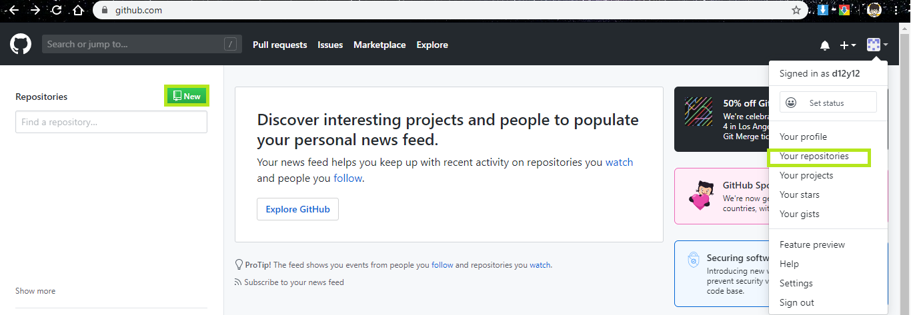
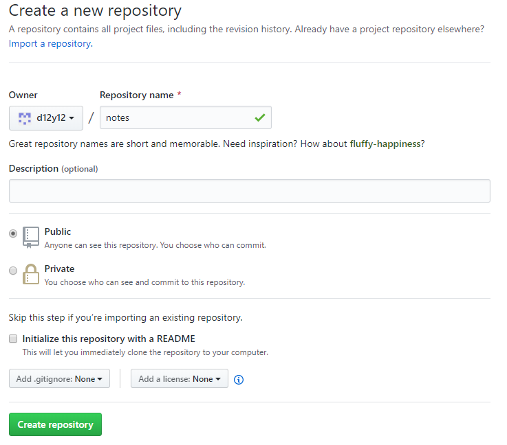

.. GitHub:

GitHub
========

.. image:: ../_static/GitHub/github_logo.png
   :height: 100

GitHub 是最大的 Git 版本库托管商，是成千上万的开发者和项目能够合作进行的中心。 
大部分 Git 版本库都托管在 GitHub，很多开源项目使用 GitHub 实现 Git 托管、
问题追踪、代码审查以及其它事情。 

注册
----

直接访问 https://github.com ， 选择一个未被占用的用户名，提供一个电子邮件地址和密码，
点击 :guilabel:`Sign up for GitHub` 即可。

常用配置
--------

* 简介

  点击 :menuselection:`头像 --> Settings --> Profile` 

  这里可以修改姓名，头像，公开邮件，自我介绍啊啥的。

* 安全

  点击 :menuselection:`头像 --> Settings --> Security`

  可以修改密码， 如果要设置两步验证不要使用 SMS , 国内不支持。

* 邮箱

  点击 :menuselection:`头像 --> Settings --> Emails`

  可以添加，修改，删除 GitHub 使用的邮箱。

SSH 配置
---------

#. 生成 SSH 密钥对
     
   在 Windows 下打开 ``git-bash``，在其他环境下打开终端。 
   输入如下命令::

      ssh-keygen -t rsa -b 4096 -C "your_email@example.com"

   这里使用你在 GitHub 中设置的邮箱地址。

   下面是我生成的例子。

   .. code-block:: shell
      :linenos:
      :emphasize-lines: 4-6

      yang@SkyLab-X1 MINGW64 /
      $ ssh-keygen -t rsa -b 4096 -C d12y12@hotmail.com
      Generating public/private rsa key pair.
      Enter file in which to save the key (/c/Users/yang/.ssh/id_rsa):
      Enter passphrase (empty for no passphrase):
      Enter same passphrase again:
      Your identification has been saved in /c/Users/yang/.ssh/id_rsa
      Your public key has been saved in /c/Users/yang/.ssh/id_rsa.pub
      ...

   * 第4行：询问密钥要存在哪，直接回车就行了。 默认存在用户的 ``~/.ssh/`` 目录
   * 第5行：输入一个密码
   * 第6行：再输一边，当然要和刚刚的一样。

   这样你的密钥对就创建好了，其中

   * id_rsa： 你的私钥
   * id_rsa.pub： 公钥
   
#. 添加密钥到 ssh-agent
     
   如果你不想每次使用密钥都输入密码，你可以把密钥添加到 ``ssh-agent``, 它会管理你的
   密钥和密码。

   启动 ssh-agent::

      $ eval $(ssh-agent -s)

   添加 SSH 私钥::

      $ ssh-add ~/.ssh/id_rsa

   这样只有第一次使用密钥的时候需要输入密码，后面就不用了。
   这里也还是有一个问题，就是你每次使用 ``git-bash`` 都要检查一下 ``ssh-agent`` 是不是
   已经打开， 没打开就要手动打开一次。

   你可以通过修改 ``~/.bashrc`` 来实现打开 ``git-bash`` 就自动启动 ssh-agent。

   *. 检查一下你的 ``~/.bashrc``，如果没有就创建一个在 ``git-bash`` 中输入 ``cp /etc/bash.bashrc .bashrc``
   *. 将下面内容复制粘贴到 ``~/.bashrc`` ::
           
         env=~/.ssh/agent.env

         agent_load_env () { test -f "$env" && . "$env" >| /dev/null ; }

         agent_start () {
             (umask 077; ssh-agent >| "$env")
             . "$env" >| /dev/null ; }

         agent_load_env

         # agent_run_state: 0=agent running w/ key; 1=agent w/o key; 2= agent not running
         agent_run_state=$(ssh-add -l >| /dev/null 2>&1; echo $?)

         if [ ! "$SSH_AUTH_SOCK" ] || [ $agent_run_state = 2 ]; then
             agent_start
             ssh-add
         elif [ "$SSH_AUTH_SOCK" ] && [ $agent_run_state = 1 ]; then
             ssh-add
         fi

         unset env
     
   这样当你启动系统后第一次使用 ``git-bash`` 时，你需要输入一次密码::

      > Initializing new SSH agent...
      > succeeded
      > Enter passphrase for /c/Users/you/.ssh/id_rsa:
      > Identity added: /c/Users/you/.ssh/id_rsa (/c/Users/you/.ssh/id_rsa)
      > Welcome to Git (version 1.6.0.2-preview20080923)
      >
      > Run 'git help git' to display the help index.
      > Run 'git help ' to display help for specific commands.

   之后 ``ssh-agent`` 进程会一直运行直到你登出，关机或者强制关闭这个进程。

#. 添加公钥到你的 GitHub 账号

   * 复制你的公钥，随便找个文字编辑工具打开 ``id_rsa.pub``， 然后复制
   * 在 GitHub ， 点击 :menuselection:`头像 --> Settings --> SSH and GPG keys`
   * 点击 :guilabel:`New SSH key`
   * 给这个新密钥一个 ``Title``, 然后把你复制的密钥拷贝进 ``Key``

      .. image:: ../_static/GitHub/github_1.png
     
   * 点击 :guilabel:`Add SSH key` , 然后需要输入你的 GitHub 密码
   * 成功如下显示
        
      .. image:: ../_static/GitHub/github_2.png
   
#. 测试

   使用如下命令::

      ssh -T git@github.com

   下面是我测试的例子，此处需要输入你创建密钥时的密码。

   .. code-block:: shell
      :linenos:

      yang@SkyLab-X1 MINGW64 /
      $ ssh -T git@github.com
      The authenticity of host 'github.com (13.229.188.59)' can't be established.
      RSA key fingerprint is SHA256:nThbg6kXUpJWGl7E1IGOCspRomTxdCARLviKw6E5SY8.
      Are you sure you want to continue connecting (yes/no/[fingerprint])? yes
      Warning: Permanently added 'github.com,13.229.188.59' (RSA) to the list of known hosts.
      Enter passphrase for key '/c/Users/yang/.ssh/id_rsa':
      Hi d12y12! You've successfully authenticated, but GitHub does not provide shell access.
     
   到此为止，你就可以使用 ssh 来访问 GitHub 了。

创建仓库
---------

一般情况下，你登陆 GitHub 后，主页的左侧会显示你的仓库。

可以直接点击 :guilabel:`new` 来创建新的仓库。 
如果你找不到也可以点击 :menuselection:`头像 --> Your repositories` , 
进入仓库页面点击 :guilabel:`new` 来创建新的仓库也可以。

接下来，给你的仓库取个名字填进去

如果你勤快的话，可以在 :guilabel:`Description` 里填一些关于项目的描述。

这里你可以让 GitHub 替你创建 README , .gitignore 和 LICENSE 文件，也可以稍后添加。

没问题就点击 :guilabel:`Create repository` 。

