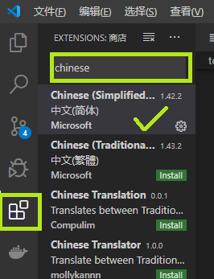

.. VScode:

Visual Studio Code
===================

.. image:: ../_static/VScode/vscode_logo.png
   :height: 100
   :target: https://code.visualstudio.com/


VS Code 安装
------------

首先根据自己的系统 `下载软件 <https://code.visualstudio.com/download>`_ 。
我使用 Windows, 这里有安装版和便携版可以选，懒得可以直接下安装版安装，我用的便携版，下载
后解压就能用。

如果你想在 PowerShell 或者 Cmd 里使用 ``code`` 命令，需要把 VS Code 加入到 ``PATH``。

VS Code 配置
------------

中文包
~~~~~~

默认 VS Code 只有英文，需要给它下一个中文包扩展。



点击 |extension_icon| ，在搜索框中输入 ``chinese``，点击  :guilabel:`install`


忘了需不需要重新启动 VS Code，如果没切换成中文你就重启一下 VS Code。

扩展位置
~~~~~~~~

如果你跟我一样是便携软件爱好者，肯定不喜欢 VS Code 默认把扩展安装在你的用户目录 ``~/.vscode/extensions/``，
这样应用程序虽然便携了，但扩展带不走了。 我写了个批处理解决这个问题, 你只需要把这个存成 ``.bat`` 文件，放到
你想存放 ``extensions`` 的文件夹，运行这个批处理就行了。 

.. code-block:: shell
   :linenos:

   @echo off
   set destDir=%CD%\extensions
   if not exist "%destDir%" (md "%destDir%")
   if exist "%UserProfile%\.vscode\extensions" (xcopy "%UserProfile%\.vscode\extensions" "%destDir%" /v /s /e /k /y)
   if exist "%UserProfile%\.vscode\extensions" (rd /S /Q "%UserProfile%\.vscode\extensions")
   mklink /D "%UserProfile%\.vscode\extensions" "%destDir%"

简单解释一下:

* 行 2: 设置目标目录为当前目录下的 ``extensions`` 目录
* 行 3: 检查目录是否存在，不存在则创建
* 行 4: 检查之前 VS Code 默认目录是否存在，存在就把里面的扩展考到这边
* 行 5: 删除默认目录
* 行 6: 创建一个目录符号链接

从 VS Code 角度开，默认目录还在那，只不过它已经链接到你指定的目录了。

以后凡是遇到默认目录不能改的，你都可以用符号链接来解决。

快捷键
~~~~~~

在 :menuselection:`文件 --> 首选项 --> 键盘快捷方式` ， 可以查看快捷键列表。

比较常用的，记录一下：

+----------------------+---------------+
|                      |               |
+======================+===============+
| ``Ctrl + Shift + P`` | 打开命令面板  |
+----------------------+---------------+
| ``Ctrl + Shift + X`` | 打开扩展面板  |
+----------------------+---------------+
| ``Ctrl + Shift + G`` | 打开 Git 面板 |
+----------------------+---------------+
| ``Ctrl + ```         | 跳到终端      |
+----------------------+---------------+

VS Code 扩展
-------------

VS Code 的扩展包含内置和安装两种。 内置扩展在发行包里就自带了，其他的扩展要自己手动安装。
可以在 `这里 <https://marketplace.visualstudio.com/vscode>`_ 搜索你感兴趣的扩展。

Git 扩展
~~~~~~~~

要使用 VSCode 中的内置 Git 扩展，首先要在系统中安装并配置好 Git , 参见 :ref:`Git命令行客户端 <Git 命令行客户端>` 。

下面介绍一下如何配置

:menuselection:`文件 --> 首选项 --> 设置`

.. image:: ../_static/VScode/vscode_git_0.png

在 :guilabel:`搜索配置` 中输入 ``git path`` , 可以看到 :guilabel:`在setting.json中编辑`，
点击打开 ``setting.json``, 并添加::

   "git.path": "your_git_path"

你可以在终端中输入 ``git status`` 试试。

配置好后，点击下图中左侧绿框的 Git 图标， 你可以看到文件的变化，``U`` 带表没有追踪， ``M`` 代表已修改。
点击右边绿框里的三个小点点，会弹出所有命令。

.. image:: ../_static/VScode/vscode_git_1.png

你可以按照自己的喜好，使用终端或者 Git 扩展。

Python 扩展
~~~~~~~~~~~~

* Python
* Anaconda Extension Pack

写作相关扩展
~~~~~~~~~~~~

* Markdown 扩展

  * Markdown All in one
  * Markdown Preview
  * markdownlint

* reStructuredText 扩展

  * reStructuredText

* 其他通用扩展

  * Badges
  * Table Formatter

有趣的扩展
~~~~~~~~~~

* vscode-icons: 可以让你的 VS Code 活泼点。
