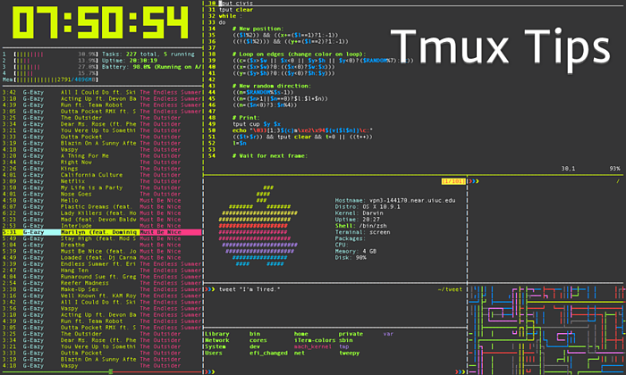

.. linux_miscellaneous:

Linux 杂记
===========

Vim
----

``vi`` 命令上下左右方向键出现字母backspace键不能删除字符的问题，
可以用两个方式解决, 可以任意选择一个:

* 修改 vim 设置文件 ``/etc/vim/vimrc.tiny`` , 修改/添加下面内容::
   
     set nocompatible 
     set backspace=2

  默认是兼容模式，上下左右是 hjkl，删除时 x X

* 用 Vim full 替换默认的 Vim tiny::

     sudo apt remove vim-common
     sudo apt install vim -y

Ubuntu 国内源
--------------

需要修改 ``/etc/apt/sources.list`` 文件，在文件最上面添加国内源::

   sudo cp /etc/apt/sources.list{,.backup}
   sudo vi /etc/apt/sources.list

修改好后，更新一下::

   sudo apt updates

* 18.04
  
  * 阿里::

       deb http://mirrors.aliyun.com/ubuntu/ bionic main restricted universe multiverse
       deb http://mirrors.aliyun.com/ubuntu/ bionic-security main restricted universe multiverse
       deb http://mirrors.aliyun.com/ubuntu/ bionic-updates main restricted universe multiverse
       deb http://mirrors.aliyun.com/ubuntu/ bionic-proposed main restricted universe multiverse
       deb http://mirrors.aliyun.com/ubuntu/ bionic-backports main restricted universe multiverse
       deb-src http://mirrors.aliyun.com/ubuntu/ bionic main restricted universe multiverse
       deb-src http://mirrors.aliyun.com/ubuntu/ bionic-security main restricted universe multiverse
       deb-src http://mirrors.aliyun.com/ubuntu/ bionic-updates main restricted universe multiverse
       deb-src http://mirrors.aliyun.com/ubuntu/ bionic-proposed main restricted universe multiverse
       deb-src http://mirrors.aliyun.com/ubuntu/ bionic-backports main restricted universe multiverse

ssh-server
-----------

#. 安装

   .. code-block:: bash
     
      sudo apt update
      sudo apt install openssh-server -y

#. 服务

   +--------------------------------+---------------+
   | 命令                           | 用途          |
   +================================+===============+
   | ``sudo systemctl stop ssh``    | 停止 ssh 服务 |
   +--------------------------------+---------------+
   | ``sudo systemctl start ssh``   | 开始 ssh 服务 |
   +--------------------------------+---------------+
   | ``sudo systemctl restart ssh`` | 重启 ssh 服务 |
   +--------------------------------+---------------+
   | ``sudo systemctl disable ssh`` | 禁用 ssh 服务 |
   +--------------------------------+---------------+
   | ``sudo systemctl enable ssh``  | 启用 ssh 服务 |
   +--------------------------------+---------------+
   | ``sudo systemctl status ssh``  | ssh 服务状态  |
   +--------------------------------+---------------+

Samba 服务器
------------

#. 安装

   .. code-block:: bash

      sudo apt update
      sudo apt install samba -y

   此命令将安装并启动 Samba 服务器 smbd 和 Samba NetBIOS 服务器 nmbd。
   如果不需要使用 nmbd，为了安全起见，您可以使用 systemctl 停止和禁用

   .. code-block:: bash

      sudo systemctl stop nmbd.service
      sudo systemctl disable nmbd.service

#. 配置

   配置文件 ``/etc/samba/smb.conf`` 中分为两部分：

   * ``[global]``: 配置 Samba 服务器的行为
   * ``[shares]``: 配置文件共享

   修改配置文件前先停止 sambd 服务::

      sudo systemctl stop smbd.service

   配置文件示例：

   .. code-block::
      :linenos:
     
      [global]
          workgroup = WORKGROUP
          server string = %h server (Samba, Ubuntu)
          dns proxy = No
          log file = /var/log/samba/log.%m
          max log size = 1000
          syslog = 0
          panic action = /usr/share/samba/panic-action %d
          server role = standalone server
          pam password change = Yes
          obey pam restrictions = Yes
          unix password sync = Yes
          passwd program = /usr/bin/passwd %u
          passwd chat = *Enter\snew\s*\spassword:* %n\n *Retype\snew\s*\spassword:* %n\n *password\supdated\ssuccessfully* .
          pam password change = yes
          map to guest = Bad User  
          usershare allow guests = Yes

      [Workspace]
          comment = yang workspace
          guest ok = Yes
          path = /home/yang/workspace
          read only = No
          valid users = yang

   这里 ``[shares]`` 名为 ``[Workspace]``。

   编译完配置文件可以用下面的命令测试::

      testparm /etc/samba/smb.conf

   如果出现::

       Loaded services file OK.

   说明配置文件可以使用。

#. 添加用户

   将 `yang` 用户添加到 samba 用户，并设置密码::

      sudo smbpasswd -a yang

#. 服务

   +--------------------------------+----------------+
   | 命令                           | 用途           |
   +================================+================+
   | ``sudo systemctl stop smbd``   | 停止 smbd 服务 |
   +--------------------------------+----------------+
   | ``sudo systemctl start smbd``  | 开始 smbd 服务 |
   +--------------------------------+----------------+
   | ``sudo systemctl restart smbd``| 重启 smbd 服务 |
   +--------------------------------+----------------+
   | ``sudo systemctl disable smbd``| 禁用 smbd 服务 |
   +--------------------------------+----------------+
   | ``sudo systemctl enable smbd`` | 启用 smbd 服务 |
   +--------------------------------+----------------+
   | ``sudo systemctl status smbd`` | smbd 服务状态  |
   +--------------------------------+----------------+

tree
-----

安装::

   sudo apt install tree -y

使用::

   tree -d                 # 只显示目录
   tree -L 1               # 只显示第一层目录
   tree > structure.txt    # 输出到文件 structure.txt

tmux
-----

.. image:: ../_static/Linux_Miscellaneous/tmux_logo.png
   :target: https://github.com/tmux/tmux/wiki

|

``Tmux`` 是一个优秀的终端复用软件，类似 GNU Screen，但来自于 OpenBSD，采用 BSD 授权, 
是 BSD 实现的 Screen 替代品，相对于Screen，它更加先进：支持屏幕切分，而且具备丰富的命令行参数，
使其可以灵活、动态的进行各种布局和操作。

使用它最直观的好处就是，通过一个终端登录远程主机并运行 ``tmux`` 后，在其中可以开启多个控制台
而无需再“浪费”多余的终端来连接这台远程主机。

Tmux 可用于在一个终端窗口中运行多个终端会话。 
不仅如此，还可以通过 Tmux 使终端会话运行于后台或是按需接入、断开会话，这个功能非常实用。

安装::

  sudo apt install tmux -y

命令:

* 列出所有 sessions::

     tmux ls

* 创建 session::

     tmux new -s <session-name>

* 连接到 session::

     tmux a -t <session-name>

* 关闭一个 session::

     tmux kill-session -t <session-name>

快捷键:

+------------+-------------+------------------------------------------------+
|            |             |                                                |
+============+=============+================================================+
| ``Ctrl+b`` | 激活控制台；此时以下按键生效                                 |
+------------+-------------+------------------------------------------------+
| 系统操作   | ?           | 列出所有快捷键；按q返回                        |
|            +-------------+------------------------------------------------+
|            | d           | 脱离当前会话, 这样可以暂时返回 Shell 界面;     |
|            |             |                                                |
|            |             | 输入 tmux attach 能够重新进入之前的会话        |
|            +-------------+------------------------------------------------+
|            | D           | 选择要脱离的会话；在同时开启了多个会话时使用   |
|            +-------------+------------------------------------------------+
|            | Ctrl+z      | 挂起当前会话                                   |
+            +-------------+------------------------------------------------+
|            | r           | 强制重绘未脱离的会话                           |
|            +-------------+------------------------------------------------+
|            | s           | 选择并切换会话；在同时开启了多个会话时使用     |
|            +-------------+------------------------------------------------+
|            | :           | 进入命令行模式；此时可以输入支持的命令，       |
|            |             |                                                |
|            |             | 例如kill-server可以关闭服务器                  |
|            +-------------+------------------------------------------------+
|            | [           | 进入复制模式；                                 |
|            |             |                                                |
|            |             | 此时的操作与 vi/emacs 相同，按 q/Esc 退出      |
|            +-------------+------------------------------------------------+
|            | ~           | 列出提示信息缓存；                             |
|            |             |                                                |
|            |             | 其中包含了之前tmux返回的各种提示信息           |
+------------+-------------+------------------------------------------------+
| 窗口操作   | c           | 创建新窗口                                     |
|            +-------------+------------------------------------------------+
|            | &           | 关闭当前窗口                                   |
|            +-------------+------------------------------------------------+
|            | 数字键      | 切换至指定窗口                                 |
|            +-------------+------------------------------------------------+
|            | p           | 切换至上一窗口                                 |
|            +-------------+------------------------------------------------+
|            | n           | 切换至下一窗口                                 |
|            +-------------+------------------------------------------------+
|            | l           | 在前后两个窗口间互相切换                       |
|            +-------------+------------------------------------------------+
|            | w           | 通过窗口列表切换窗口                           |
|            +-------------+------------------------------------------------+
|            | ,           | 重命名当前窗口；这样便于识别                   |
|            +-------------+------------------------------------------------+
|            | .           | 修改当前窗口编号；相当于窗口重新排序           |
|            +-------------+------------------------------------------------+
|            | f           | 在所有窗口中查找指定文本                       |
+------------+-------------+------------------------------------------------+
| 面板操作   | ”           | 将当前面板平分为上下两块                       |
|            +-------------+------------------------------------------------+
|            | %           | 将当前面板平分为左右两块                       |
|            +-------------+------------------------------------------------+
|            | x           | 关闭当前面板                                   |
|            +-------------+------------------------------------------------+
|            | !           | 将当前面板置于新窗口；                         |
|            |             |                                                |
|            |             | 即新建一个窗口，其中仅包含当前面板             |
|            +-------------+------------------------------------------------+
|            | Ctrl+方向键 | 以1个单元格为单位移动边缘以调整当前面板大小    |
|            +-------------+------------------------------------------------+
|            | Alt+方向键  | 以5个单元格为单位移动边缘以调整当前面板大小    |
|            +-------------+------------------------------------------------+
|            | Space       | 在预置的面板布局中循环切换；                   |
|            |             |                                                |
|            |             | 依次包括 even-horizontal、even-vertical、      |
|            |             |                                                |
|            |             | main-horizontal、main-vertical、tiled          |
|            +-------------+------------------------------------------------+
|            | q           | 显示面板编号                                   |
|            +-------------+------------------------------------------------+
|            | o           | 在当前窗口中选择下一面板                       |
|            +-------------+------------------------------------------------+
|            | 方向键      | 移动光标以选择面板                             |
|            +-------------+------------------------------------------------+
|            | {           | 向前置换当前面板                               |
|            +-------------+------------------------------------------------+
|            | }           | 向后置换当前面板                               |
|            +-------------+------------------------------------------------+
|            | Alt+o       | 逆时针旋转当前窗口的面板                       |
|            +-------------+------------------------------------------------+
|            | Ctrl+o      | 顺时针旋转当前窗口的面板                       |
+------------+-------------+------------------------------------------------+

ls
-----

使用 ``ls -l`` 或者 ``ll`` 命令，可以使用长格式显示文件内容，察看更详细的文件资料::

   yang@SkyLab:~/workspace/tmp$ ls -l
   total 36
   -rw-rw-r-- 1 yang yang  445 4月   4 20:56 cgit.conf
   -rw-rw-r-- 1 yang yang   52 4月   4 21:01 cgitrc
   -rwxrw-r-- 1 yang yang  833 4月   6 18:40 Dockerfile
   -rw-rw-r-- 1 yang yang 4891 4月   3 22:57 Dockerfile_bak
   -rw-rw-r-- 1 yang yang 4737 4月   3 21:22 Dockerfile_nginx
   -rw-rw-r-- 1 yang yang   46 4月   4 20:58 spawn-fcgi.cgit
   drwxr-xr-x 6 yang yang 4096 4月  11 17:32 spider.git

   |文件属性|文件数|拥有者|所属组|文件大小|创建时间|文件名|

* 文件属性
  
  +------+----------------------+----------+----------+--------------+
  |      |                      |          |          |              |
  +======+======================+==========+==========+==============+
  | 分类 | 文件属性             | 属主权限 | 属组权限 | 其他用户权限 |
  +------+----------------------+----------+----------+--------------+
  | 字符 | 0                    | 1 2 3    | 4 5 6    | 7 8 9        |
  +------+----------------------+----------+----------+--------------+
  | 说明 | d 目录               | r w x      r - x      r - x        |
  |      |                      |                                    |  
  |      | - 文件               | r 可读(read)                       |
  |      |                      |                                    | 
  |      | l 链接文件           | w 可写(write)                      |
  |      |                      |                                    |  
  |      | b 可供储存的接口设备 | x 可执行(execute)                  |
  |      |                      |                                    |
  |      |   随机存取装置       | - 无权限                           |
  |      |                      |                                    |
  |      | c 串行端口设备       |                                    |
  |      |                      |                                    |
  |      |   一次性读取装置     |                                    |
  +------+----------------------+------------------------------------+

  可使用 ``chmod`` 修改权限。

chmod
-------

使用方式1::

   chmod [-cfvR] [--help] [--version] mode file... 

参数:

* ``mode``: 权限设定字串，格式如下::

     [ugoa...][[+-=][rwxX]...][,...]

  - [ugoa....]
    u 表示拥有者，g 表示与拥有者属于同组者，o 表示其他人，a 表示这三者皆是。 
  - [+-=]
    + 表示增加权限、- 表示取消权限、= 表示唯一设定权限。
  - [rwxX]
    r 表示可读，w 表示可写，x 表示可执行，X 表示只有当该文件是个子目录或者该文件已经被设定过为可执行。

* ``-c``: 若该文件权限确实已经更改，才显示其更改动作
* ``-f`` : 若该文件权限无法被更改也不要显示错误讯息
* ``-v`` : 显示权限变更的详细资料
* ``-R``: 对目前目录下的所有文件与子目录进行相同的权限变更(即以递回的方式逐个变更)
* ``--help`` : 显示帮助
* ``--version``: 显示版本

例子:

* 将 file1.txt 设为所有人皆可读::

     chmod ugo+r file1.txt

* 将 file1.txt 设为所有人皆可读::

     chmod a+r file1.txt

* 将 file1.txt 与 file2.txt 设为拥有者，与其所属同组可写，但其他人不可写入::

     chmod ug+w,o-w file1.txt file2.txt

* 将 ex1.py 设为拥有者可以执行::

     chmod u+x ex1.py

* 将目前目录下的所有档案与子目录皆设为任何人可读取::
     
     chmod -R a+r *

使用方式2::

   chmod abc file

参数:

* ``abc``: 各为一个数字，分别表示拥有者、同组者、及其他人的权限::

     r=4，w=2，x=1

  - 若要rwx属性则4+2+1=7
  - 若要rw-属性则4+2=6
  - 若要r-x属性则4+1=5

例子:

* 将 file1.py 设为所有人有所有权限::

     chmod a=rwx file1.py   
     chmod 777 file  
  
  两种方式效果一致。

* 将 file1.py 设为拥有者及同组者有所有权限，其他人有执行权限::

   chmod ug=rwx,o=x file1.py
   chmod 771 file  

  两种方式效果一致。
  

