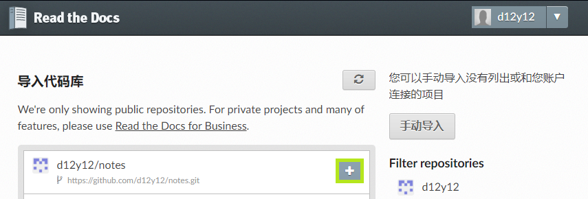

.. Sphinx_RTD_Github:

Sphinx & ReadTheDocs & GitHub 集成写作环境
==========================================

R.I.P. "Konami Code" creator Kazuhisa Hashimoto, Feb 25, 2020.

Sphinx_ 是一款工具可以生成文档项目，把 reStructuredText_ 文件转换为其他文件格式
(如 HTML, PDF, MAN, EPUB)，并自动生成交叉引用，索引等待。

`Read the Docs`_ 为开源社区提供文档托管的平台，支持 Sphinx_ 工具，它可以从你的 
Subversion_, Bazaar_, Git_, 和 Mercurial_ 仓库拉取源文件，构建文档，并更新在线文档。 

`GitHub`_ 是一个面向开源及私有开发项目的托管平台。 

.. _Read the docs: https://readthedocs.org/
.. _Sphinx: http://www.sphinx-doc.org/
.. _reStructuredText: http://www.sphinx-doc.org/en/master/usage/restructuredtext/basics.html
.. _Subversion: http://subversion.tigris.org/
.. _Bazaar: http://bazaar.canonical.com/
.. _Git: http://git-scm.com/
.. _Mercurial: https://www.mercurial-scm.org/
.. _GitHub: https://github.com/

本文主要介绍如何使用 Sphinx 生成文档项目，将项目托管在 GitHub ，并使用 Read the Docs 
构建并托管生成的 HTML ，进而实现文档的持续生成及在线浏览。

注册账号
---------

直接去 `Read the docs`_ 和 `GitHub`_ 上注册就行。

创建 GitHub 仓库
-----------------

* 创建远程仓库

  在 GitHub 上创建一个远程仓库， 如果不会，参考 :ref:`这里 <创建仓库>`

* 创建本地仓库

  把你的远程仓库拉取到本地，你可以使用命令行，或者其他软件例如 Sourcetree，
  参考 :ref:`这里 <Sourcetree>`

创建 Sphinx 项目
-----------------

创建 Python 环境
~~~~~~~~~~~~~~~~

首先使用 Conda 创建环境。

.. code-block:: shell

   conda create --name doc python
   conda activate doc
   conda install sphinx sphinx_rtd_theme

.. seealso::

   关于如何使用 Conda 的详细介绍， 请参见 :doc:`Conda </tools/Conda>`

创建项目
~~~~~~~~~

接下来我们使用 Sphinx 来创建项目, 先看例子。

.. code-block:: shell

   (base) PS C:\Users\yang> conda activate doc
   (doc) PS C:\Users\yang> cd E:\Git\notes\
   (doc) PS E:\Git\notes> sphinx-quickstart
   Welcome to the Sphinx 2.4.0 quickstart utility.

   Please enter values for the following settings (just press Enter to
   accept a default value, if one is given in brackets).

   Selected root path: .

   You have two options for placing the build directory for Sphinx output.
   Either, you use a directory "_build" within the root path, or you separate
   "source" and "build" directories within the root path.
   > Separate source and build directories (y/n) [n]:

   The project name will occur in several places in the built documentation.
   > Project name: Yang的笔记
   > Author name(s): yang
   > Project release []: 0.1.0

   If the documents are to be written in a language other than English,
   you can select a language here by its language code. Sphinx will then
   translate text that it generates into that language.

   For a list of supported codes, see
   https://www.sphinx-doc.org/en/master/usage/configuration.html#confval-language.
   > Project language [en]: zh_CN

   Creating file .\conf.py.
   Creating file .\index.rst.
   Creating file .\Makefile.
   Creating file .\make.bat.

   Finished: An initial directory structure has been created.

   You should now populate your master file .\index.rst and create other documentation
   source files. Use the Makefile to build the docs, like so:
   make builder
   where "builder" is one of the supported builders, e.g. html, latex or linkcheck.

简单解释一下：

#. ``conda activate doc`` 激活doc环境 
#. ``cd E:\Git\notes\`` 路由到你的本地仓库目录
#. ``sphinx-quickstart`` 命令创建项目，命令中需要的输入

   * Separate source and build directories： 是否分开代码和构建目录，不需要选 ``n``
   * Project name: 项目名称，你选个喜欢的名字
   * Author name(s): 作者，你的名字
   * Project release []: 项目版本，这个你随意，后面会被替换掉的
   * Project language [en]: 项目使用语言，你要写英文文档，就不用动，要写简体中文文档
     就输入 ``zh_CN``, 这个很重要，因为会影响输出文档的字体。

项目创建好的目录结构如下::

   .
   ├── _build     (构建目录)
   ├── _static    (静态文件目录)
   ├── _templates (放置模板目录)
   ├── conf.py    (配置文件)
   ├── index.rst  (文档首页文件)
   ├── Makefile  
   ├── Make.bat   (Windows下生成命令)

必要修改
~~~~~~~~~

如果你懒得看，这里有一个完整的\ `例子 <https://github.com/d12y12/notes/archive/0.1.0.zip>`_ 。

#. ``conf.py`` 是 Sphinx 的配置文件，下面是一个示例

   .. literalinclude:: ../_static/Sphinx_RTD_Github/conf_example.py
      :language: python
      :linenos:
      :emphasize-lines: 13, 19, 21

   这里我们只修改了几个小的地方:

   * 添加 ``master-doc`` , 指的是文档的入口，一般是目录页
   * 修改 ``exclude_patterns`` , 将 ``README.rst`` 添加到去除列表，这样不会编译它
   * 修改 ``html_theme``, 使用 Read the Docs 的模板

#. 添加 .gitignore 文件, 用于 Git 忽略某些文件或文件夹。

   .. code-block::
      :linenos:
      :emphasize-lines: 3,4

      Thumbs.db
      .DS_Store
      _build
      .vscode
   
   这里去除的是头两行是 Windows 或 MacOs 生成的一些系统文件。
   还需要忽略构建文件夹 (_build)， 及其他不需要提交的文件，比如我这里使用的 VScode 的
   配置文件。

#. 添加 README.rst 或 README.md ， 用作项目描述
   
   随便写点什么都可以。 

   如果使用 ``README.rst``, 需要加入到 ``exclude_patterns`` ， 这个文件不需要编译。

#. 添加 LICENSE 文件， 我选择的是 ``CC-BY-SA-4.0``

生成输出
~~~~~~~~

使用 ``make <builder>`` 命令来生成输出， 常用的 <builder> 有
``html`` 和 ``latexpdf``。 

例如要创建 HTML 输出，只需要运行 ``make html``, 
下面是个例子(这个例子不是刚生成项目的时候)：

.. code-block:: shell

   (doc) PS E:\Git\notes> make html
   Running Sphinx v2.4.0
   loading translations [zh_CN]... done
   loading pickled environment... done
   building [mo]: targets for 0 po files that are out of date
   building [html]: targets for 0 source files that are out of date
   updating environment: 0 added, 1 changed, 0 removed
   ...
   build succeeded.

   The HTML pages are in _build\html.

你可以在浏览器打开 ``_build\html\index.html`` 来预览生成效果。

创建 Read The Docs 项目
------------------------

创建 Read The Docs 项目，同时也是 Read The Docs 和 GitHub 集成的过程。

导入项目
~~~~~~~~

假设你已有 Read The docs 账户，登录之后，点击用户名旁边倒三角下拉菜单中的 
:guilabel:`我的项目`, 点击 :guilabel:`Import a Project`

第一次导入的时候，需要 GitHub 授权

.. image:: ../_static/Sphinx_RTD_Github/rtd2.png

同意授权即可。

你也可以在用户名旁边倒三角下拉菜单中的 :guilabel:`设置`, 点击 :guilabel:`已连接的服务` 中查看授权状态，
或者使用 :guilabel:`Connect to GitHub` 来进行授权。

在 GitHub 的 :menuselection:`Personal Setting --> Applications --> 
Authorized OAuth Apps` 中可以查看你已授权的应用。

授权成功后，你可以看到自己的项目列表

点击你想导入项目旁边的 :guilabel:`+`

给项目取个名字，然后点击 :guilabel:`下一页`, 就完成项目导入了。

此时再点击 :guilabel:`我的项目` , 你就能看到导入的项目了。

点击 :guilabel:`项目`，会进入 :guilabel:`项目概况` 页面。

关于 :guilabel:`项目概况` 页面，这里有几点要说一下:

* :guilabel:`版本`，展示 Read The Docs 自动构建的版本，默认只有 ``latest`` , 也就是最新版本。
  如果你打了标签( tag )，就会出现 ``statble`` , 表示稳定版。 这个主要是开发说明文档 
  使用，对应不同软件版本。我这种纯文档项目，打标签的意义并不大，我这里打标签只是为了展示用。
* :guilabel:`Build version` 按钮， 点击可以触发一次立即构建
* :guilabel:`上次构建`，显示上次构建状态，如我的这个上次就失败了，你可以点击上面概况旁边的 :guilabel:`构建` 按钮
  查看构建日志。
* :guilabel:`短地址`，访问在线文档的地址

再说一下 :guilabel:`概况` 旁边的几个按钮:

* :guilabel:`下载`, 进入下载页面，下载输出文档，如 PDF，HTML 打包，EPUB
* :guilabel:`搜索`, 进入搜索页面
* :guilabel:`构建`, 进入构建页面，可以查看构建历史，构建日志，或触发立即构建
* :guilabel:`版本`, 进入版本页面，可以激活或者去激活一个版本，设置版本的隐私级别如公开或私有
* :guilabel:`管理`, 进入管理页面，可管理的东西很多，这里就不列举了，我们现在需要用的就是 :guilabel:`集成`

到此为止，Read The Docs 项目就创建成功了，你可以试试手动触发编译一下，然后点击 :guilabel:`阅读文档` 
看看效果。

Webhook
~~~~~~~~

虽然上面的项目可以使用，但每次都要手动触发，我们希望的是当 GitHub 的远程仓库发生变化的时候
就触发 Read The Docs 进行文档编译，像持续集成代码一样持续集成文档，这就需要用到 Webhook 。

Webhook是一种 Web 回调 API ， 简单说就是可以在 GitHub 上注册一个回调 URL，当 GitHub 发生
变化的时候，会产生事件，驱动调用这个 URL，使用 POST 把变化传回去，注册方收到回调，进行处理。

* Read The Docs 端
  
  在 :guilabel:`管理页面` 中点击 :menuselection:`集成 --> 添加集成`

  .. image:: ../_static/Sphinx_RTD_Github/rtd7.png

  在下拉列表中选择 :guilabel:`GitHub 进向 webhook`, Read The Docs 会生成一个回调 URL，如::

    https://readthedocs.org/api/v2/webhook/yang/113113/

  记下这个 URL， Read The Docs 端就算完成了。

* GitHub 端

  在 :guilabel:`项目页面` 点击 :menuselection:`Setting --> Webhooks`,

  .. image:: ../_static/Sphinx_RTD_Github/github_1.png

  点击 :guilabel:`Add webhook`, 然后填空：

  * :guilabel:`Payload URL` , 填 Read The Docs 生成的回调 URL
  * :guilabel:`Content type` ,  ``application/json`` 或 ``application/x-www-form-urlencoded`` 
    都可以
  * :guilabel:`Secrets` , 空着就行
  * :guilabel:`Which events would you like to trigger this webhook?` , 选择 
    :guilabel:`Let me select individual events` 来自定义触发事件，比如可以选择
    :guilabel:`Branch or tag creation` , :guilabel:`Branch or tag deletion` 和 :guilabel:`Pushes`
  * 确保 :guilabel:`Active` 是勾选的，然后点击 :guilabel:`Add webhook`
  
  在添加 Webhook 的过程中需要输入 GitHub 的密码来确认。

到此为止，集成就结束了，你可以随便 ``Push`` 点东西到 GitHub，来确认 Read The Docs 
是否触发了自动构建。

进阶配置
---------

Read the Docs 配置文件
~~~~~~~~~~~~~~~~~~~~~~~

使用配置文件，可以让 Read the Docs 的生成环境和你本地的一样。

配置文件的名字必须是下面几个之一：

* readthedocs.yml
* readthedocs.yaml
* .readthedocs.yml
* .readthedocs.yaml

下面是个例子。

.. code-block::
   :linenos:

   # .readthedocs.yml
   # Read the Docs configuration file
   # See https://docs.readthedocs.io/en/stable/config-file/v2.html for details

   # Required
   version: 2

   # Build documentation in the docs/ directory with Sphinx
   sphinx:
     configuration: conf.py

   # Optionally build your docs in additional formats such as PDF and ePub
   formats: all

   conda:
     environment: rtd_env.yml

这里 Conda 的环境文件要用 ``conda env export --from-history`` 导出。

